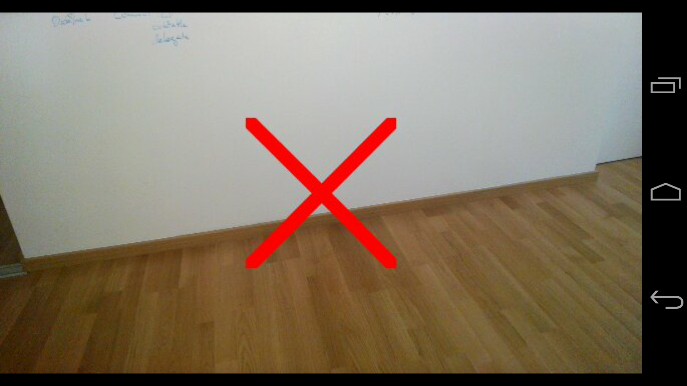

## Google Glass Showcase Apps by Namics AG

### Why

We became an owner of a Google Glass® :)

### What

We decided to implement some basic applications and share our know-how from the cases. Here on GitHub, we share learnings and insights regarding technical aspects of our software development for the Google Glass.

### Prerequisites

The following things are required for google glass development:
- Android capable IDE (Eclipse, IntelliJ). My personal favourite: Android Studio (Beta). Actually, the demo code is implemented with Android Studio.
- Android SDK (API 15; Android 4.0.3)
- Google Glass GDK (downloadable over Android SDK Manager under API 15)
- A fairly good knowledge about Android development
- Basic project setup (new project with android SDK linked to project, git, whatever...)

### Showcases

#### NamicsLiveWordmark
As a first first approach an application for the google glass was implemented to gain knowledge of the GDK. Basically it is a “hello world” application, which does nothing more than downloading a Namics AG word mark and showing these on a live card. These word marks can be downloaded over http://gdw.namics.com and are fetched via a background task. As the mark is fetched, the background task starts a callback, which receives the word mark and then updates the UI on the main thread.
My personal approach was to start a service over a glass voice trigger and then update the live tile as long as the service runs. If you want to stop the service, you can tap the glass and open the menu on the live tile. There is a stop menu item which disables the live service and hides the card.

```java
uiHandler.post(new Runnable() {
                                
    @Override
    public void run() {
        remoteViews.setProgressBar(R.id.wordmark_showtime, 10, updateCounter, false);
        remoteViews.setTextViewText(R.id.wordmark_text, mark);
        liveCard.setViews(remoteViews); 
    }

});
```
The uihandler represents a looper object, which updates the views and runs in the main thread.

#### ColorRecognition

Actually, this is an android phone project. It's kind of a "proof of concept" to use a camera preview and recognize the color below a crosshair. The most interesting thing about this showcase is the "CameraPreview.java" class, which extends View and handles the preview of the android camera to support real time image processing.

#### NespressoCapsuleInformation

Now this is the project you want to know about. The purpose of the application is to determine a specific Nespresso capsule under a certain crosshair and show some information about it. My approach was to show a camera preview to the user with a small circle in the middle of the screen and then recognize the color below the circle. As a first idea an image recognition is initialized, but due to limited processor capacities of the glass and little amount of time, this was no option. Another approach was to send an image to a specific image recognition api and categorize the image. After some tests, the recognition was not as accurate as it was intended to be. Eventually, the approach is considered to regard a certain pixel and determine its color. With this possibility at hand, it is able - with a fairly big threshold - to determine the color of the object the user is pointing at.

No color recognized:


With the recognition working, the next step was to design an immersion (focused view in glass GUI). The provided capsule information are hardcoded in the app, because downloading information from the internet was out of scope and is fairly easy to implement for a proof of concept. Luckily, designing GUIs for glass is as simple as designing activities for any common android device. To provide an adequate UI you should design your activities with the following specifications:
- Resolution: 640 x 360 px
- Size: “small”
- Screen Ration: “notlong”
- Density: “hdpi”
- Input: “DPad”
- Ram: 682 mb

The hardest part was to show a timeline alike view where the user is able to scroll through a capsule’s information. Herefore, a [CardScrollView](https://developers.google.com/glass/develop/gdk/reference/com/google/android/glass/widget/CardScrollView) is used, which delivers view by view to scroll through.

```java
public class CapsuleInformationScrollView extends CardScrollView {
    /* … */
}
```

### Learnings

- Coding an application for google glass is not as hard as it sounds, if you have certain knowledge about coding applications for android
- Immersions provide the most flexibility for the UI but are the hardest to implement
- [CardScrollView](https://developers.google.com/glass/develop/gdk/reference/com/google/android/glass/widget/CardScrollView) uses simple views that can be inflated with the LayoutInflater and saved into a list
- “ok glass” menu is not accessable in the GDK for now :(   [source](http://stackoverflow.com/questions/20133577/adding-the-ok-glass-contextual-voice-menu-within-an-immersion-activity/20134647#20134647)
- Accessing any hardware features like the camera is exactly as you would do in android

### Questions?

Ask me :)
Over GitHub or [christoph.buehler(at)namics.com](mailto:christoph.buehler@namics.com)

